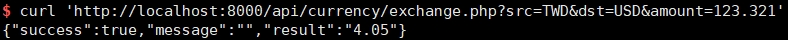

# 匯率轉換 API

[文件](api_doc.md)

[資料庫問答](DB_QA.md)

執行下列流程即可快速測試 API

```bash
cd public/
php -S 0.0.0.0:8000
curl 'http://localhost:8000/api/currency/exchange.php?src=TWD&dst=USD&amount=123.321'
```

執行結果：


